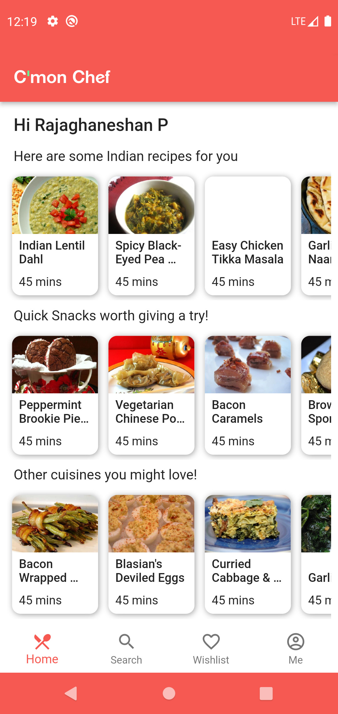
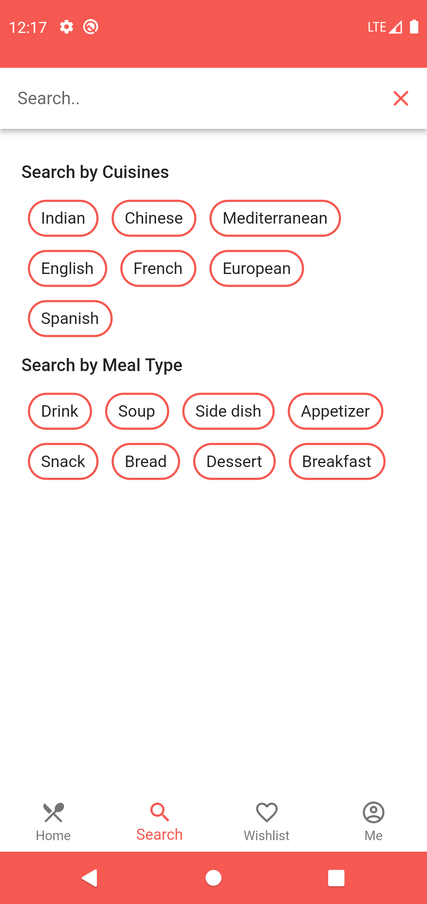
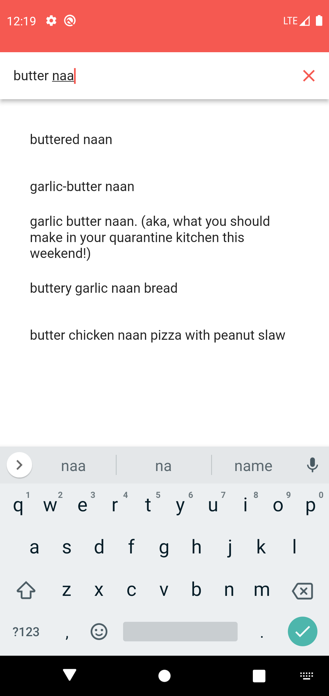
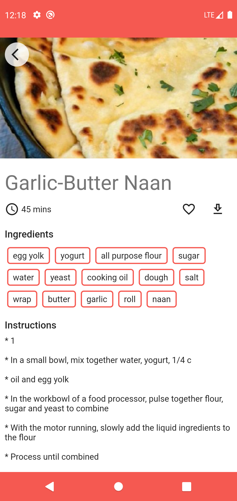
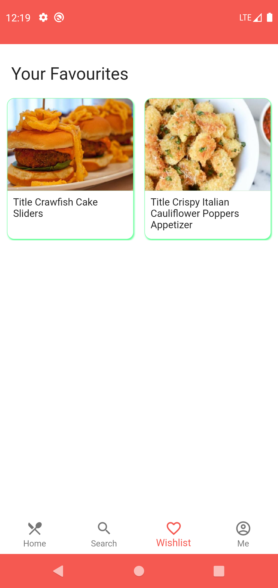
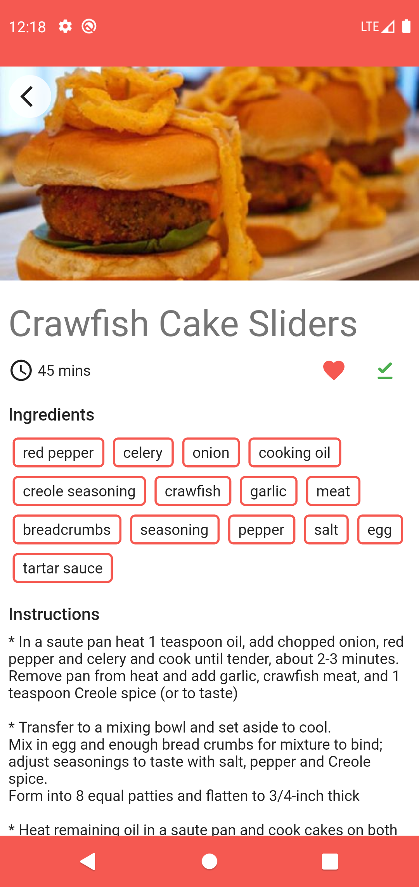
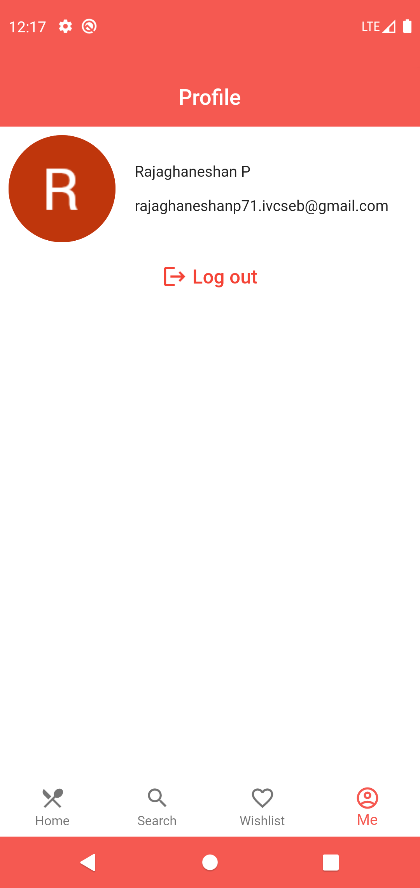

# cmon_chef
## Recipe app

### This app contains recipes with various features as listed below

1. Authentication with Google_sign_in
2. Recipes from API
3. Firebase Firestore integration to store user details and wishlist
4. Hive used to store recipes offline
5. Search feature to search recipes from API and display them
6. Search by cuisines/ diet type also added
7. Clean architecture pattern follwed
8. GetX state management used

Screenshots

      

   

